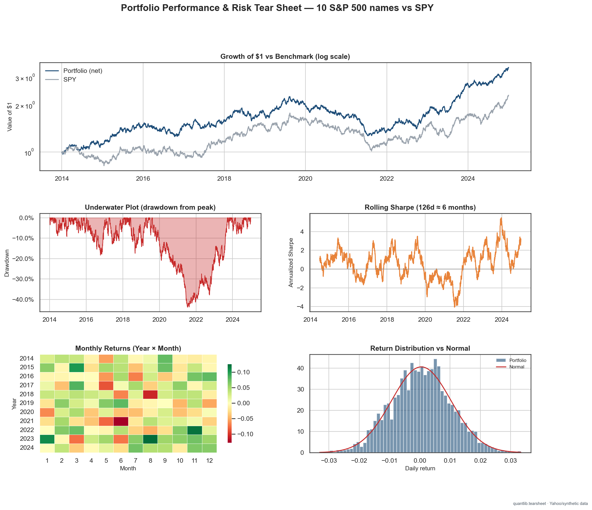

# Portfolio Performance & Risk Tear Sheet

A reproducible, fund-grade performance tear sheet for a diversified 10-stock S&P 500 book, benchmarked against SPY. Monthly-rebalanced, cost-aware, and runnable with no API keys.

## Methods
Simple/log return mechanics; equal-weight monthly rebalancing with turnover-based transaction costs (gross **and** net); CAGR, annualized vol, Sharpe, Sortino, Calmar, max drawdown, hit rate, historical VaR/Expected Shortfall; Newey–West (HAC) t-stats, a Lo (2002) Sharpe confidence interval, and a CAPM alpha/beta decomposition; walk-forward stability and cost/rebalance/regime robustness checks.

## Data
Yahoo Finance daily adjusted close; FRED `DGS3MO` risk-free. No keys required — a labeled synthetic fallback (`QUANT_OFFLINE=1`) runs the notebook end to end. **This run used synthetic (offline) data.**

## How to run
Open the notebook in Colab → *Run all*. Figures/CSVs are written to `outputs/`.

## Results highlight
Net of costs, the book returns **11.6% CAGR** at **15.6%** volatility — a **Sharpe of 0.66** vs SPY's **0.41**, with a max drawdown of **-43.8%** vs SPY's **-42.8%**.

## Limitations
Hindsight-selected large-cap universe (survivorship bias); descriptive, not a validated selection strategy; proportional cost model (no market impact); synthetic fallback numbers are illustrative.

## Built with
pandas, numpy, scipy, statsmodels, matplotlib, seaborn, plotly, kaleido.
