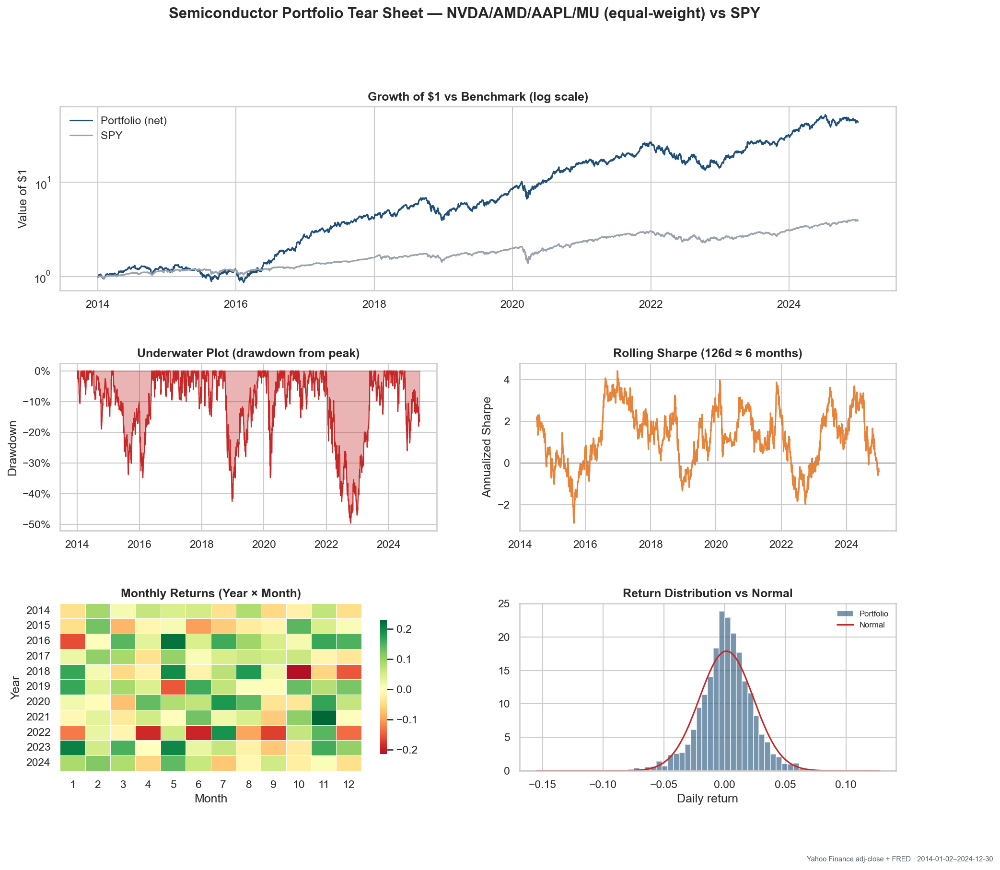

# Semiconductor Portfolio — Performance & Risk Tear Sheet

Real-data performance & risk tear sheet for an equal-weight **NVDA / AMD / AAPL / MU** book, monthly-rebalanced and cost-aware, benchmarked against SPY (2014-01-02–2024-12-30).

## Results (11y, real Yahoo data)
| Series | CAGR | Ann.Vol | Sharpe | MaxDD |
|---|---|---|---|---|
| Portfolio (net) | 41.0% | 35.4% | 1.09 | -49.5% |
| SPY | 13.2% | 17.1% | 0.69 | -33.7% |

CAPM vs SPY: alpha +20.4%/yr (t=3.07), beta 1.54, R²=0.55.

## Methods
Yahoo chart-API adjusted close; equal-weight monthly rebalancing with turnover-based costs (gross & net); CAGR/vol/Sharpe/Sortino/Calmar/MaxDD/VaR/ES; Newey–West HAC t-stats, Lo (2002) Sharpe CI, CAPM decomposition; cost/rebalance/regime robustness.

## How to run
Open in Colab → Run all (no keys; keyless data with a synthetic fallback). Figures/tables write to `outputs/`.

## Limitations
Hindsight-selected winners (major selection bias) — attribution, not a strategy; concentrated & high-beta (~50% drawdown); proportional cost model; SPY benchmark (a semi ETF would be fairer).
