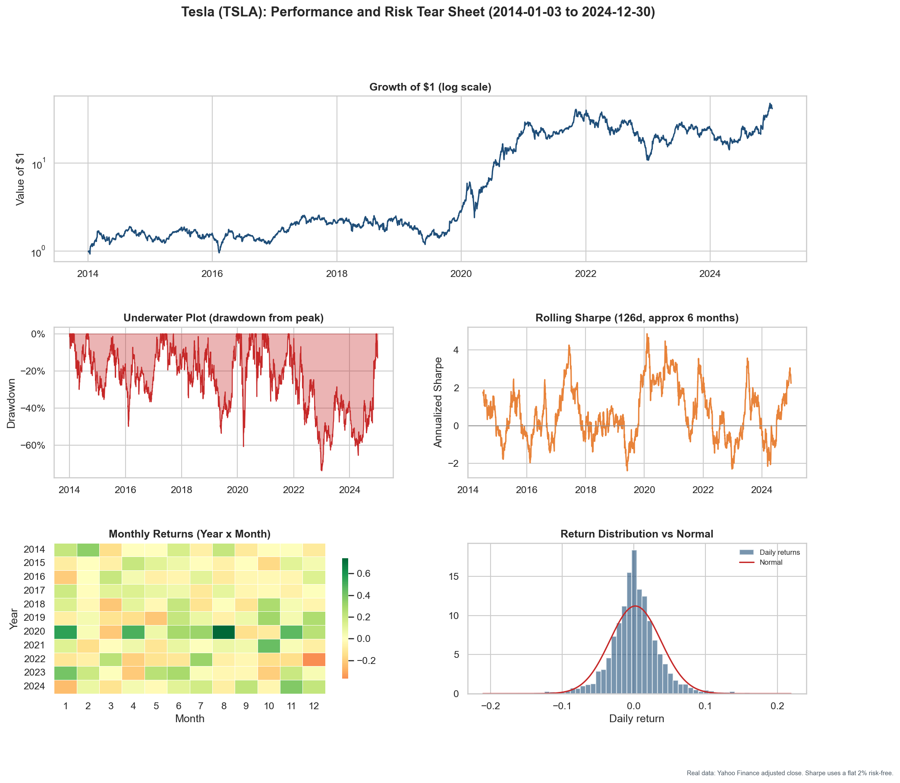
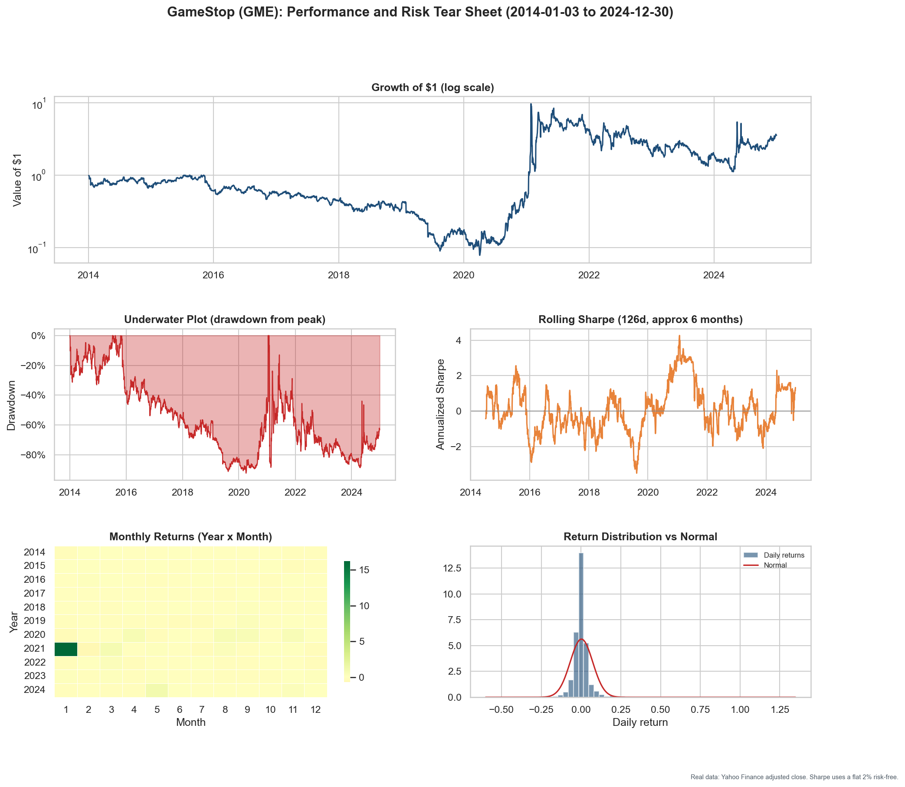
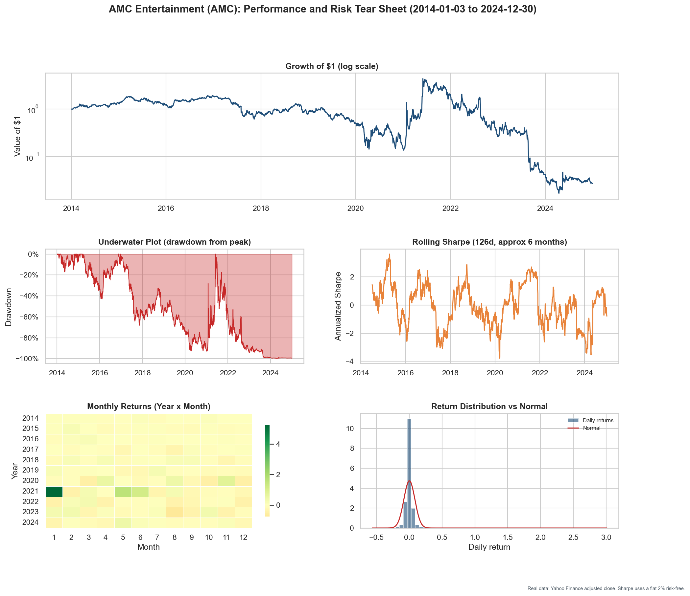
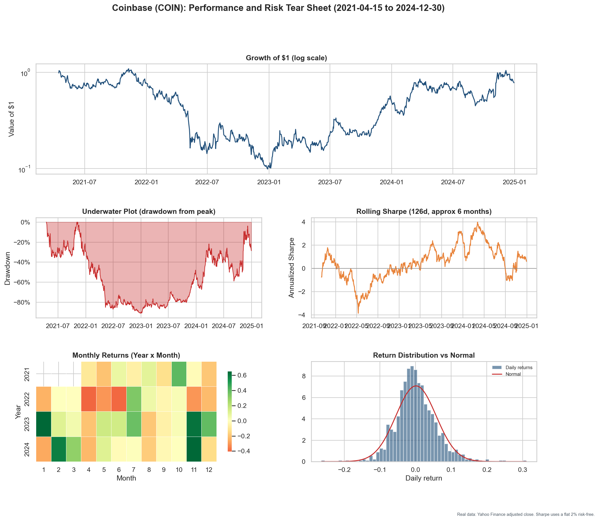
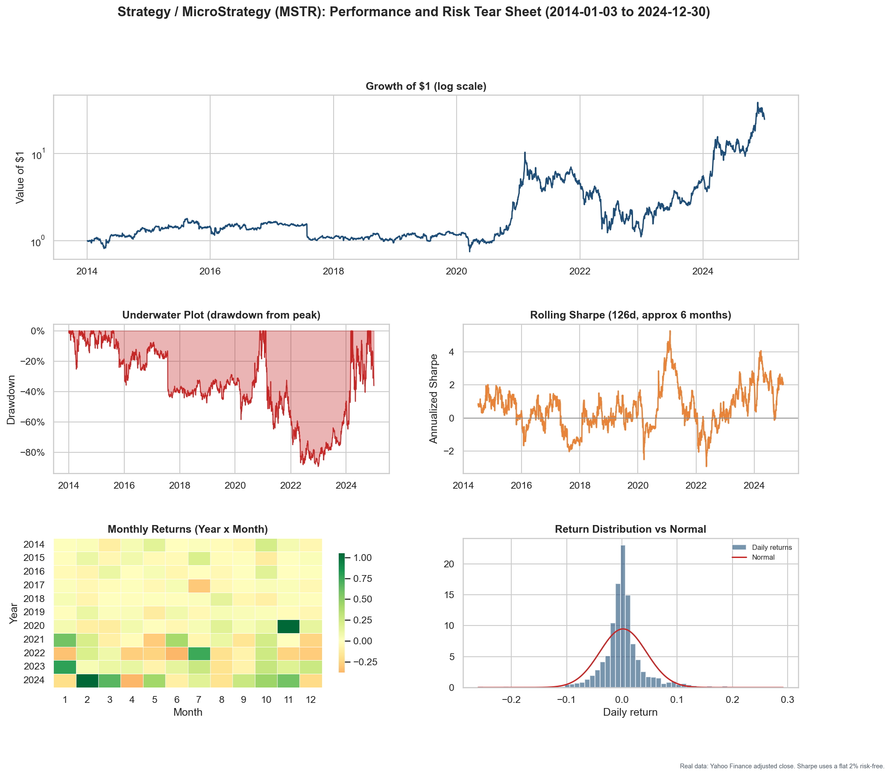
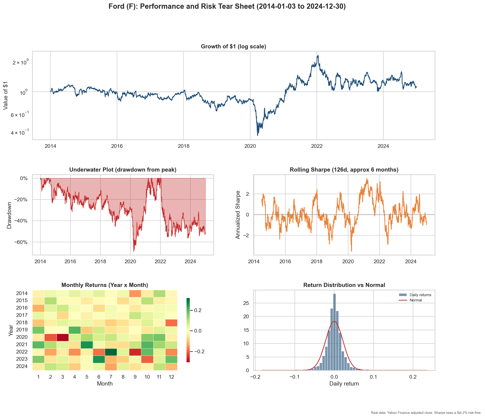
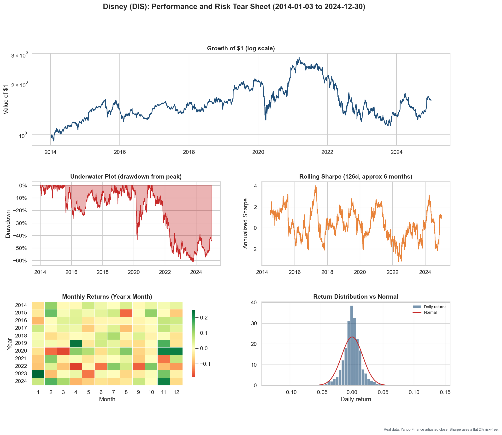
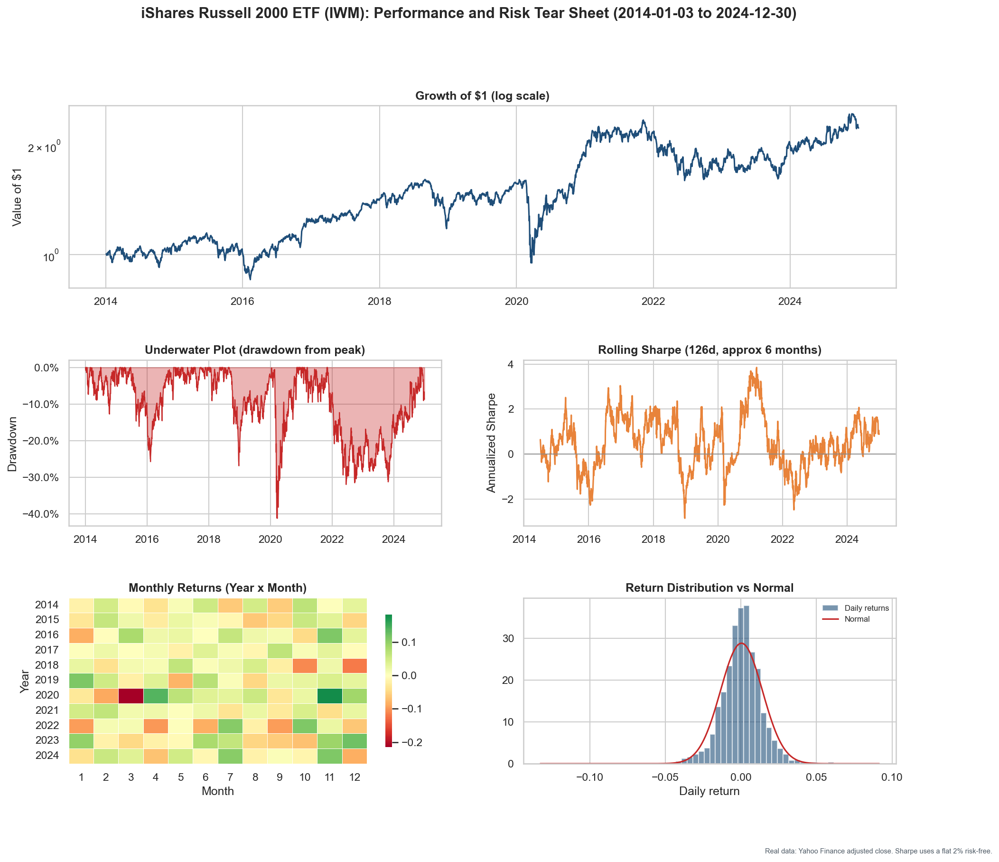
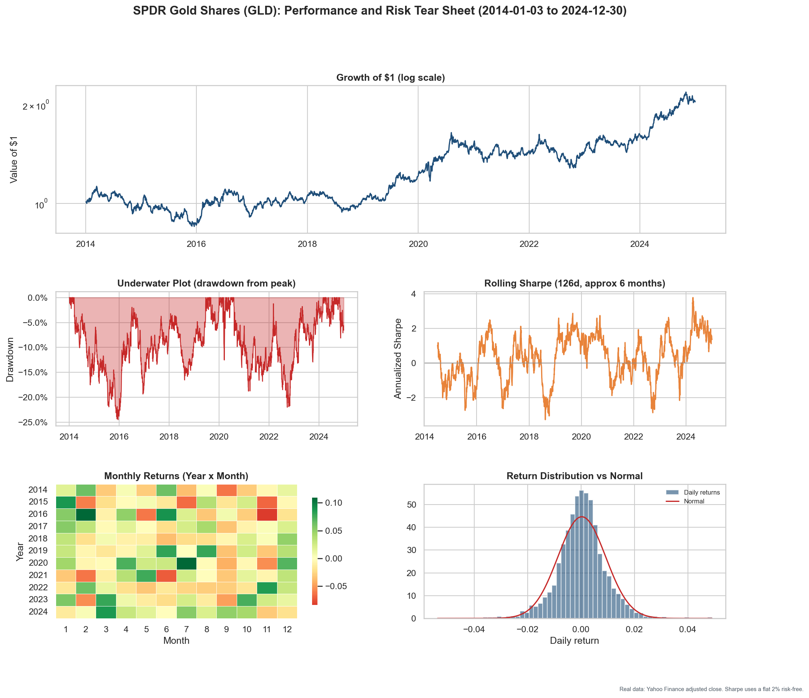
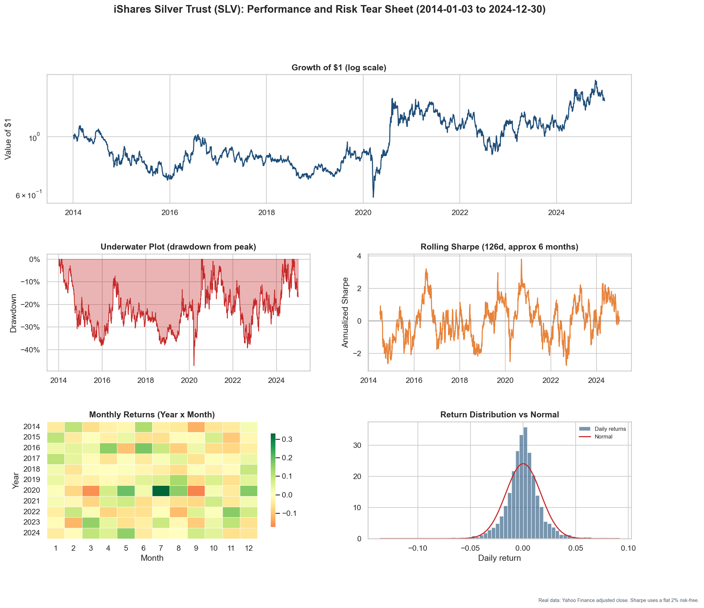

# Performance Tear Sheet Generator

Live app: [performancesheet.streamlit.app](https://performancesheet.streamlit.app)

Type any Yahoo Finance symbol, optionally pick a benchmark and a date range, and the app builds a full performance and risk tear sheet in the browser: growth of one dollar on a log scale, the drawdown-from-peak underwater plot, a rolling six-month Sharpe ratio, a monthly-return heatmap, and the daily-return distribution against a normal curve, topped with headline metric tiles and a complete statistics table, plus a one-click PNG download in the house style. It handles stocks and ETFs (NVDA, SPY), indexes (^GSPC), futures (ES=F), and crypto pairs (BTC-USD).

## How it works

The app ([`app/app.py`](app/app.py)) is a Streamlit front end over three quantlib modules vendored in [`app/quantlib/`](app/quantlib), so a clean clone runs with nothing beyond the pinned requirements:

- **Data layer** (`data.py`) downloads Yahoo Finance adjusted closes with retries and local caching, and prints a provenance note for every fetch. When a symbol cannot be fetched it returns clearly labeled synthetic data; the app detects that label and shows an error instead of plotting fake prices.
- **Metrics** (`metrics.py`) is the single source of truth for every statistic shown: CAGR, annualized volatility, Sharpe, Sortino, Calmar, max drawdown, hit rate, historical VaR and CVaR, best and worst day, skew, and kurtosis.
- **Renderers** (`tearsheet.py`) draw the same numbers twice: the interactive Plotly dashboard shown on the page, and the static matplotlib figure behind the PNG download.

The ticker boxes suggest symbols as you type from a curated list of about 700 liquid names ([`app/tickers.csv`](app/tickers.csv): the S&P 500, widely traded ETFs, major ADRs, indexes, futures, and crypto), and still accept any symbol Yahoo recognizes. A collapsible guide on the page explains the symbol formats for newcomers, and bad tickers get a clear error rather than a chart of fallback data.

## Running it yourself

From the repo root:

```
pip install -r requirements.txt
streamlit run "Tear Sheets/app/app.py"
```

The public site runs on Streamlit Community Cloud and redeploys automatically on every push to main.

## Gallery: pre-generated tear sheets

The sheets below were batch-generated with the same pipeline by [`tear_sheets.ipynb`](tear_sheets.ipynb) for 28 widely followed stocks, ETFs, and funds, each measured on its own with no benchmark, from 2014 (or the ticker's inception if later) through 2024. The notebook runs with no API keys and prints which data path is active.

## Summary statistics

Sharpe and Sortino use a flat 2% annual risk-free rate. HAC t is the Newey-West t-statistic that the mean daily return differs from zero (above about 2 is significant at the 5% level). Some series have shorter histories because they launched after 2014 (AIQ 2018, BOTZ 2016, PLTR and COIN 2020 to 2021), so their statistics cover a shorter window.

| Category | Series | Ticker | CAGR | Ann. vol | Sharpe | Sortino | Max drawdown | HAC t |
|---|---|---|---|---|---|---|---|---|
| Broad-market baselines | SPY (S&P 500 ETF) | SPY | 13.2% | 17.1% | 0.69 | 0.97 | -33.7% | 3.06 |
| Broad-market baselines | S&P 500 Index | ^GSPC | 11.3% | 17.3% | 0.59 | 0.82 | -33.9% | 2.68 |
| Semiconductor ETFs | VanEck Semiconductor ETF (SMH) | SMH | 26.5% | 29.6% | 0.87 | 1.26 | -45.3% | 3.62 |
| Semiconductor ETFs | iShares Semiconductor ETF (SOXX) | SOXX | 23.7% | 30.2% | 0.79 | 1.14 | -45.8% | 3.35 |
| AI-themed ETFs | Global X AI and Technology ETF (AIQ) | AIQ | 15.9% | 25.2% | 0.63 | 0.89 | -44.7% | 1.98 |
| AI-themed ETFs | Global X Robotics and AI ETF (BOTZ) | BOTZ | 10.3% | 25.4% | 0.44 | 0.61 | -55.5% | 1.46 |
| AI chips and hardware | NVIDIA (NVDA) | NVDA | 71.3% | 47.0% | 1.34 | 2.09 | -66.3% | 4.77 |
| AI chips and hardware | AMD | AMD | 36.7% | 57.3% | 0.79 | 1.24 | -65.4% | 2.88 |
| AI chips and hardware | Broadcom (AVGO) | AVGO | 45.1% | 37.0% | 1.14 | 1.75 | -48.3% | 4.55 |
| AI chips and hardware | TSMC (TSM) | TSM | 28.6% | 31.2% | 0.90 | 1.37 | -56.5% | 3.43 |
| AI chips and hardware | Micron (MU) | MU | 13.5% | 45.9% | 0.46 | 0.67 | -73.8% | 1.85 |
| AI platforms and software | Microsoft (MSFT) | MSFT | 26.9% | 26.5% | 0.96 | 1.42 | -37.1% | 4.43 |
| AI platforms and software | Alphabet (GOOGL) | GOOGL | 19.2% | 27.9% | 0.70 | 1.02 | -44.3% | 3.00 |
| AI platforms and software | Amazon (AMZN) | AMZN | 24.5% | 32.7% | 0.77 | 1.14 | -56.1% | 3.00 |
| AI platforms and software | Meta (META) | META | 24.3% | 37.3% | 0.72 | 1.04 | -76.7% | 2.89 |
| AI platforms and software | Apple (AAPL) | AAPL | 27.7% | 27.9% | 0.94 | 1.39 | -38.5% | 3.52 |
| AI platforms and software | Oracle (ORCL) | ORCL | 16.2% | 26.9% | 0.62 | 0.92 | -40.4% | 2.66 |
| AI platforms and software | Palantir (PLTR) | PLTR | 63.9% | 71.7% | 1.01 | 1.69 | -84.6% | 1.97 |
| Popular retail-trader tickers | Tesla (TSLA) | TSLA | 40.5% | 56.4% | 0.85 | 1.29 | -73.6% | 2.72 |
| Popular retail-trader tickers | GameStop (GME) | GME | 12.3% | 112.3% | 0.57 | 1.10 | -92.2% | 1.72 |
| Popular retail-trader tickers | AMC Entertainment (AMC) | AMC | -28.0% | 133.3% | 0.19 | 0.42 | -99.6% | 0.63 |
| Popular retail-trader tickers | Coinbase (COIN) | COIN | -6.5% | 89.4% | 0.34 | 0.53 | -90.9% | 0.67 |
| Popular retail-trader tickers | Strategy / MicroStrategy (MSTR) | MSTR | 33.8% | 66.8% | 0.74 | 1.15 | -89.3% | 2.35 |
| Popular retail-trader tickers | Ford (F) | F | 0.9% | 34.8% | 0.14 | 0.20 | -68.8% | 0.64 |
| Popular retail-trader tickers | Disney (DIS) | DIS | 4.4% | 27.1% | 0.22 | 0.32 | -60.7% | 0.98 |
| Popular retail-trader tickers | iShares Russell 2000 ETF (IWM) | IWM | 7.6% | 22.0% | 0.35 | 0.49 | -41.1% | 1.52 |
| Popular retail-trader tickers | SPDR Gold Shares (GLD) | GLD | 6.7% | 14.2% | 0.39 | 0.56 | -24.5% | 1.84 |
| Popular retail-trader tickers | iShares Silver Trust (SLV) | SLV | 2.9% | 26.3% | 0.17 | 0.24 | -47.1% | 0.81 |

## Broad-market baselines

### SPY (S&P 500 ETF)


### S&P 500 Index


## Semiconductor ETFs

### VanEck Semiconductor ETF (SMH)


### iShares Semiconductor ETF (SOXX)


## AI-themed ETFs

### Global X AI and Technology ETF (AIQ)


### Global X Robotics and AI ETF (BOTZ)


## AI chips and hardware

### NVIDIA (NVDA)


### AMD


### Broadcom (AVGO)


### TSMC (TSM)


### Micron (MU)


## AI platforms and software

### Microsoft (MSFT)


### Alphabet (GOOGL)


### Amazon (AMZN)


### Meta (META)


### Apple (AAPL)


### Oracle (ORCL)


### Palantir (PLTR)


## Popular retail-trader tickers

### Tesla (TSLA)



### GameStop (GME)



### AMC Entertainment (AMC)



### Coinbase (COIN)



### Strategy / MicroStrategy (MSTR)



### Ford (F)



### Disney (DIS)



### iShares Russell 2000 ETF (IWM)



### SPDR Gold Shares (GLD)



### iShares Silver Trust (SLV)



## Notes and limitations

- These are descriptive tear sheets of single assets and funds, not strategies. Past compounding does not predict future returns.
- The S&P 500 index (^GSPC) is price only, so it excludes dividends. SPY is a total-return series (dividends reinvested through the adjusted close), which is why SPY shows a higher CAGR than the index over the same window.
- Some series launched after 2014, so their tear sheets cover shorter windows: AIQ (2018), BOTZ (2016), PLTR (2020), and COIN (2021). Shorter windows make their statistics less reliable than the full eleven-year names.
- Several of the retail-trader names are highly volatile (GME, AMC, MSTR, and COIN in particular), with very large drawdowns. High single-name volatility makes point estimates like Sharpe noisier.
- Sharpe and Sortino use a flat 2% annual risk-free rate, close to the average 3-month Treasury yield over the period.
- Yahoo adjusted closes are revised for splits and dividends after the fact, so they are not a point-in-time record of what a trader saw on the day.
