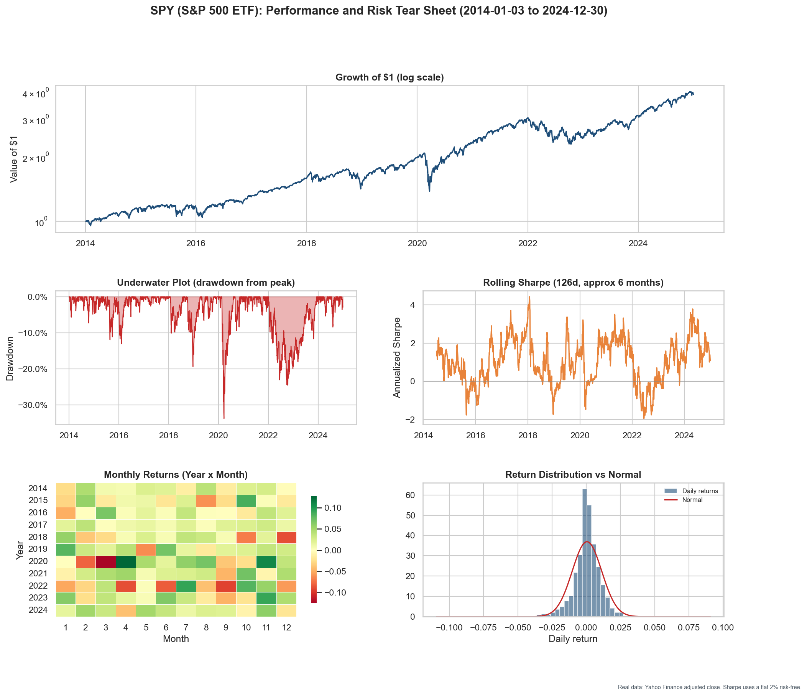
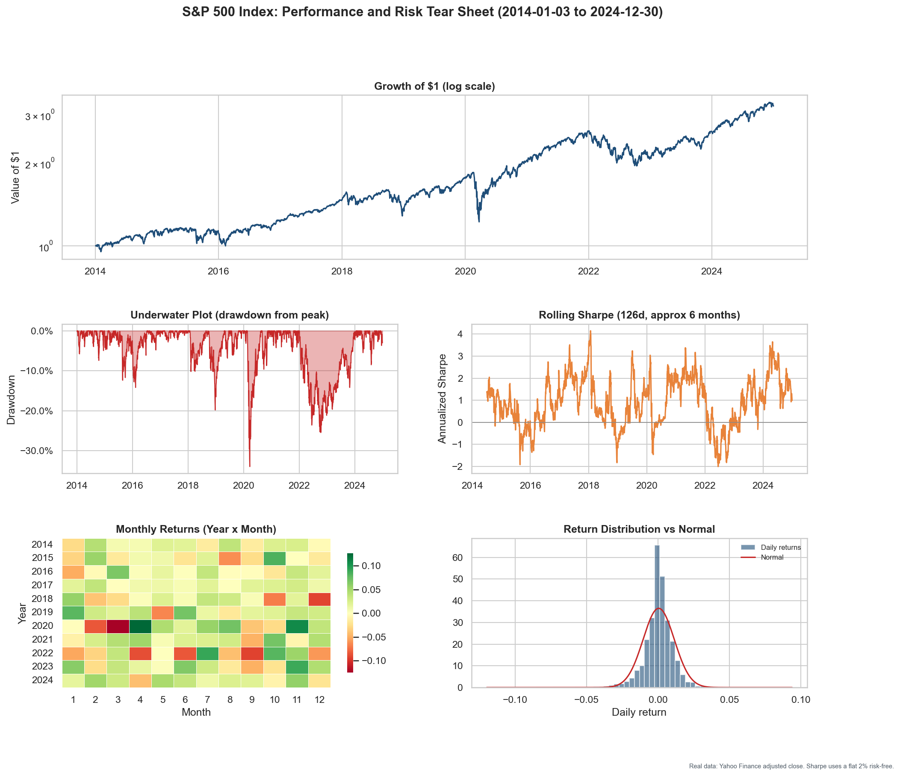
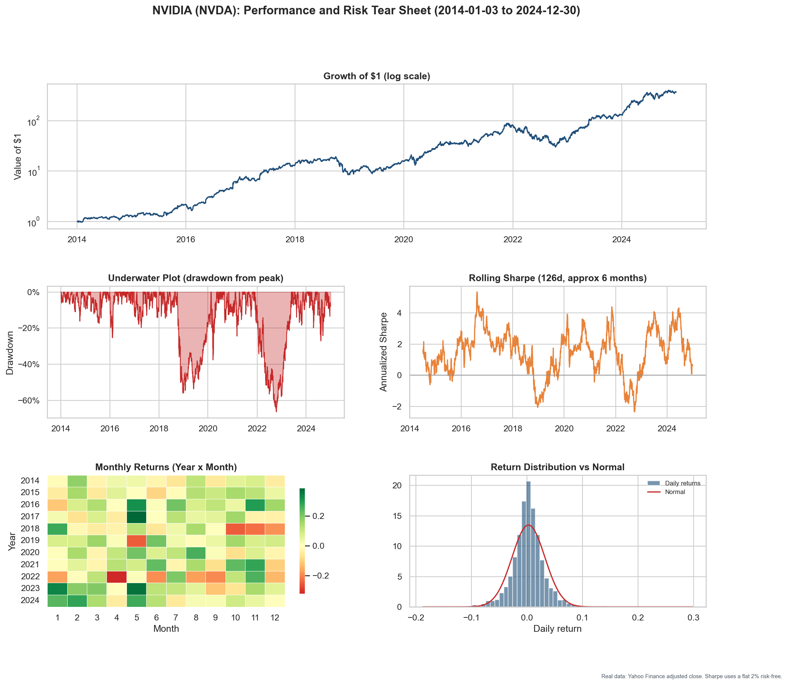
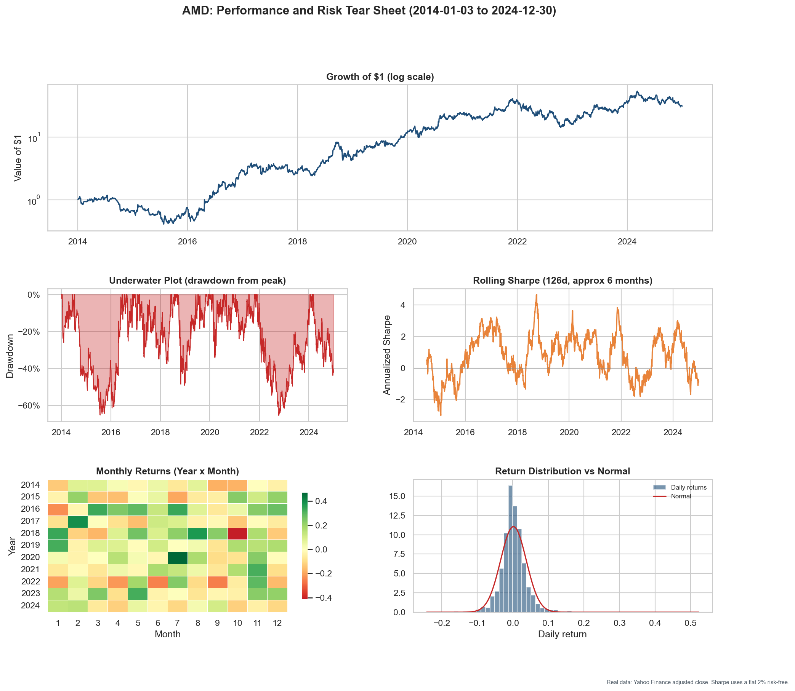
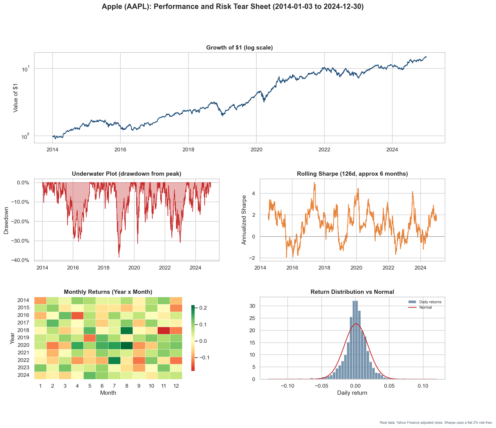
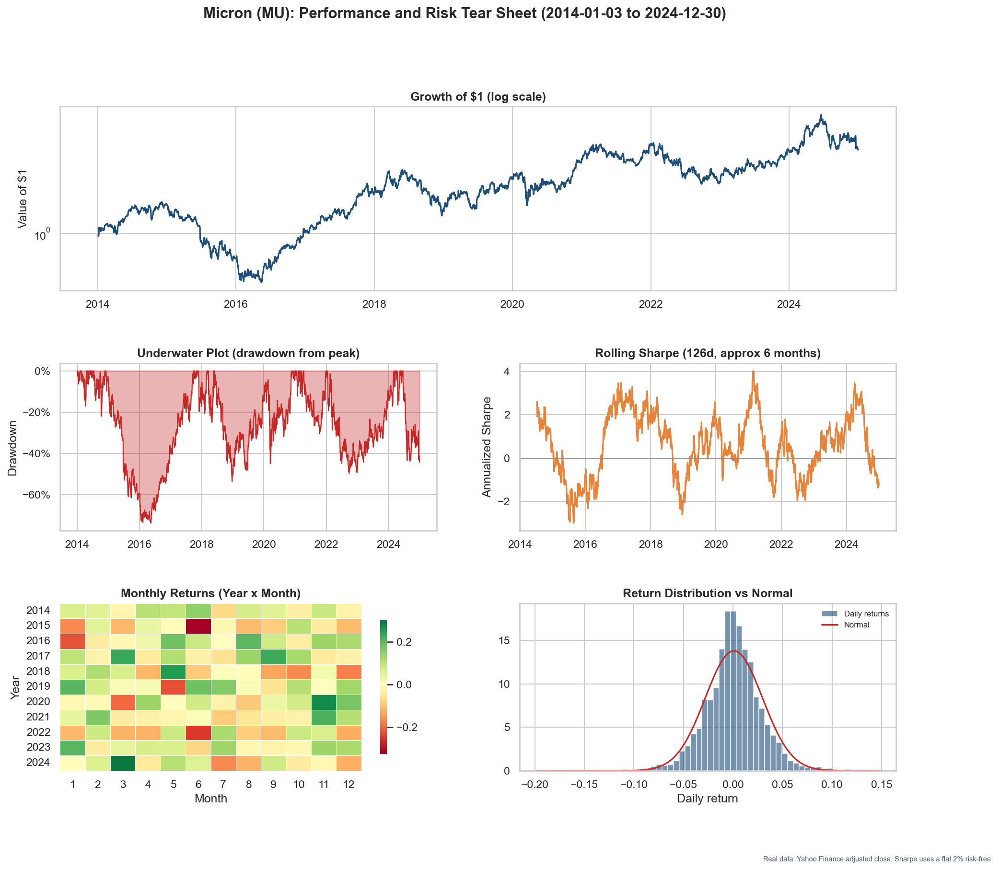

# Performance and Risk Tear Sheets

Standalone tear sheets for six individual series, each measured on its own with no benchmark comparison. Built from real Yahoo Finance adjusted-close data over 2014 to 2024. Every tear sheet shows the growth of one dollar (log scale), the drawdown-from-peak underwater plot, a rolling six-month Sharpe ratio, a monthly-return heatmap, and the daily-return distribution against a normal curve.

The notebook that produces all of these is [`tear_sheets.ipynb`](tear_sheets.ipynb). It runs with no API keys and prints which data path is active. Open it in Colab from the badge inside the notebook to refresh with the latest prices.

## Summary statistics (2014 to 2024, real data)

Sharpe and Sortino use a flat 2% annual risk-free rate. HAC t is the Newey-West t-statistic that the mean daily return differs from zero (above about 2 is significant at the 5% level).

| Series | CAGR | Ann. vol | Sharpe | Sortino | Max drawdown | HAC t |
|---|---|---|---|---|---|---|
| SPY (S&P 500 ETF) | 13.2% | 17.1% | 0.69 | 0.97 | -33.7% | 3.06 |
| S&P 500 Index (^GSPC) | 11.3% | 17.3% | 0.59 | 0.82 | -33.9% | 2.69 |
| NVIDIA (NVDA) | 71.3% | 47.0% | 1.34 | 2.09 | -66.3% | 4.77 |
| AMD | 36.7% | 57.3% | 0.79 | 1.24 | -65.4% | 2.88 |
| Apple (AAPL) | 27.7% | 27.9% | 0.94 | 1.39 | -38.5% | 3.52 |
| Micron (MU) | 13.5% | 45.9% | 0.46 | 0.67 | -73.8% | 1.85 |

A note on the two index rows: SPY is a total-return series (dividends reinvested through the adjusted close), while the S&P 500 index (^GSPC) is price only. That difference in dividends is why SPY shows a higher CAGR than the index over the same window.

## SPY (S&P 500 ETF)

## S&P 500 Index (^GSPC)

## NVIDIA (NVDA)

## AMD

## Apple (AAPL)

## Micron (MU)

## Limitations

These are descriptive tear sheets of single assets, not strategies. Past compounding does not predict future returns, and these are large, well-known names whose past paths reflect outcomes that were not knowable in advance. Yahoo adjusted closes are revised for splits and dividends after the fact, so they are not a point-in-time record.
