# Performance and Risk Tear Sheets

Standalone tear sheets for individual series across the AI and semiconductor ecosystem, each measured on its own with no benchmark comparison. Built from real Yahoo Finance adjusted-close data (from 2014, or from the ticker's inception if later, through 2024). Every tear sheet shows the growth of one dollar (log scale), the drawdown-from-peak underwater plot, a rolling six-month Sharpe ratio, a monthly-return heatmap, and the daily-return distribution against a normal curve.

The notebook that produces all of these is [`tear_sheets.ipynb`](tear_sheets.ipynb). It runs with no API keys and prints which data path is active.

## Summary statistics

Sharpe and Sortino use a flat 2% annual risk-free rate. HAC t is the Newey-West t-statistic that the mean daily return differs from zero (above about 2 is significant at the 5% level). AIQ, BOTZ, and PLTR have shorter histories because they launched after 2014 (2018, 2016, and 2020), so their statistics cover a shorter window.

| Category | Series | Ticker | CAGR | Ann. vol | Sharpe | Sortino | Max drawdown | HAC t |
|---|---|---|---|---|---|---|---|---|
| Broad-market baselines | SPY (S&P 500 ETF) | SPY | 13.2% | 17.1% | 0.69 | 0.97 | -33.7% | 3.06 |
| Broad-market baselines | S&P 500 Index | ^GSPC | 11.3% | 17.3% | 0.59 | 0.82 | -33.9% | 2.68 |
| Semiconductor ETFs | VanEck Semiconductor ETF (SMH) | SMH | 26.5% | 29.6% | 0.87 | 1.26 | -45.3% | 3.62 |
| Semiconductor ETFs | iShares Semiconductor ETF (SOXX) | SOXX | 23.7% | 30.2% | 0.79 | 1.14 | -45.8% | 3.35 |
| AI-themed ETFs | Global X AI and Technology ETF (AIQ) | AIQ | 15.9% | 25.2% | 0.63 | 0.89 | -44.7% | 1.98 |
| AI-themed ETFs | Global X Robotics and AI ETF (BOTZ) | BOTZ | 10.3% | 25.4% | 0.44 | 0.61 | -55.5% | 1.46 |
| AI chips and hardware | NVIDIA (NVDA) | NVDA | 71.3% | 47.0% | 1.34 | 2.09 | -66.3% | 4.77 |
| AI chips and hardware | AMD | AMD | 36.7% | 57.3% | 0.79 | 1.24 | -65.4% | 2.88 |
| AI chips and hardware | Broadcom (AVGO) | AVGO | 45.1% | 37.0% | 1.14 | 1.75 | -48.3% | 4.55 |
| AI chips and hardware | TSMC (TSM) | TSM | 28.6% | 31.2% | 0.90 | 1.37 | -56.5% | 3.43 |
| AI chips and hardware | Micron (MU) | MU | 13.5% | 45.9% | 0.46 | 0.67 | -73.8% | 1.85 |
| AI platforms and software | Microsoft (MSFT) | MSFT | 26.9% | 26.5% | 0.96 | 1.42 | -37.1% | 4.43 |
| AI platforms and software | Alphabet (GOOGL) | GOOGL | 19.2% | 27.9% | 0.70 | 1.02 | -44.3% | 3.00 |
| AI platforms and software | Amazon (AMZN) | AMZN | 24.5% | 32.7% | 0.77 | 1.14 | -56.1% | 3.00 |
| AI platforms and software | Meta (META) | META | 24.3% | 37.3% | 0.72 | 1.04 | -76.7% | 2.89 |
| AI platforms and software | Apple (AAPL) | AAPL | 27.7% | 27.9% | 0.94 | 1.39 | -38.5% | 3.52 |
| AI platforms and software | Oracle (ORCL) | ORCL | 16.2% | 26.9% | 0.62 | 0.92 | -40.4% | 2.66 |
| AI platforms and software | Palantir (PLTR) | PLTR | 63.9% | 71.7% | 1.01 | 1.69 | -84.6% | 1.97 |

## Broad-market baselines

### SPY (S&P 500 ETF)

### S&P 500 Index

## Semiconductor ETFs

### VanEck Semiconductor ETF (SMH)

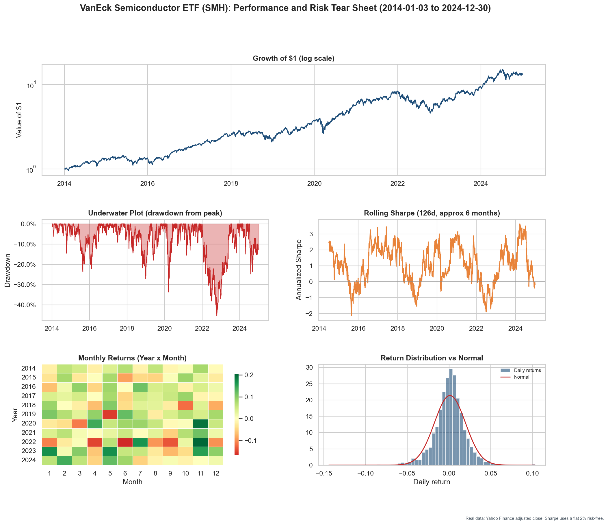

### iShares Semiconductor ETF (SOXX)

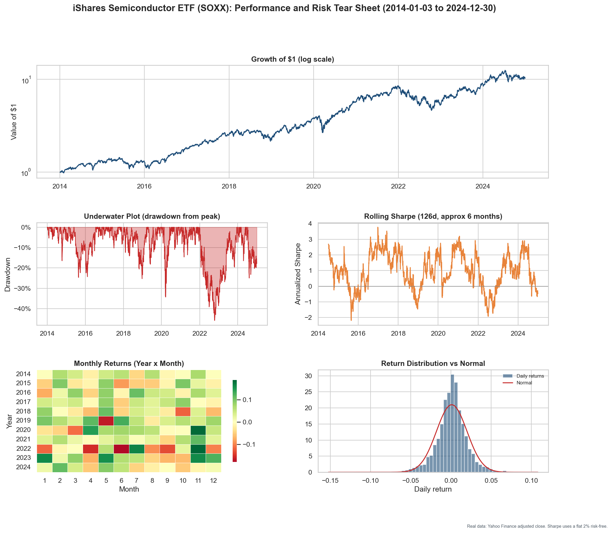

## AI-themed ETFs

### Global X AI and Technology ETF (AIQ)

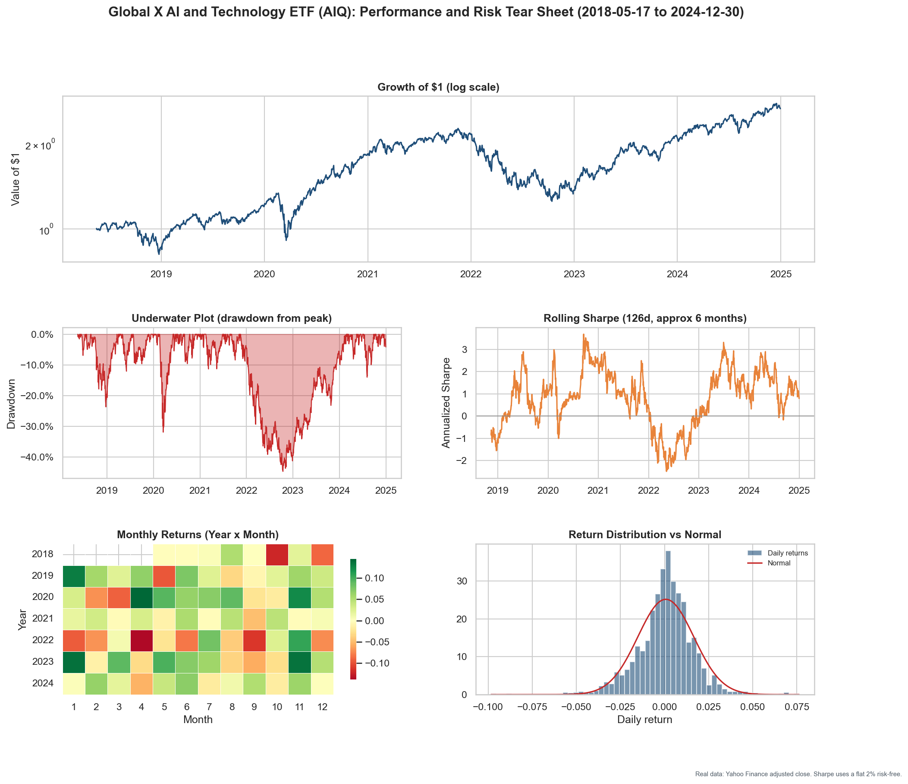

### Global X Robotics and AI ETF (BOTZ)

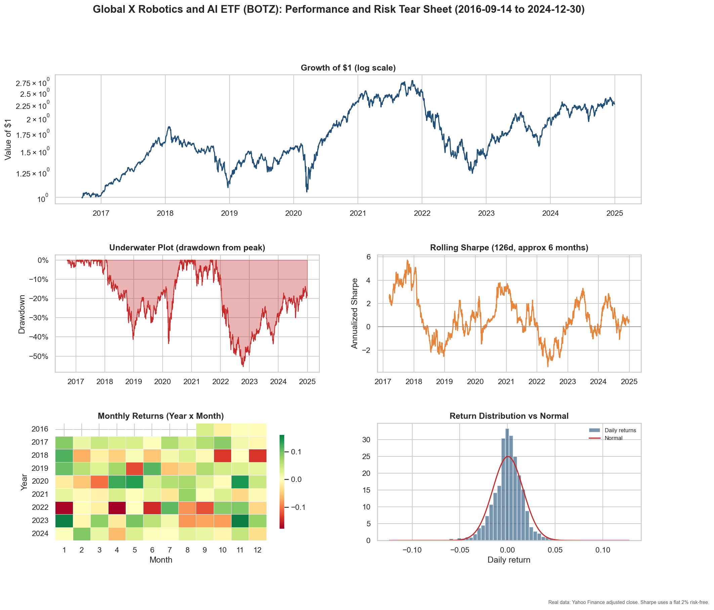

## AI chips and hardware

### NVIDIA (NVDA)

### AMD

### Broadcom (AVGO)

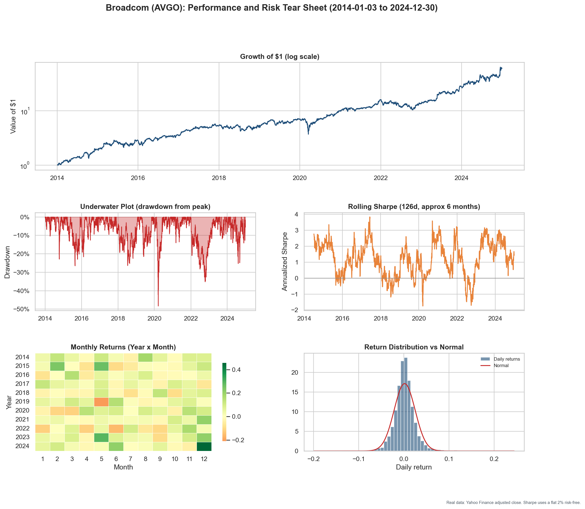

### TSMC (TSM)

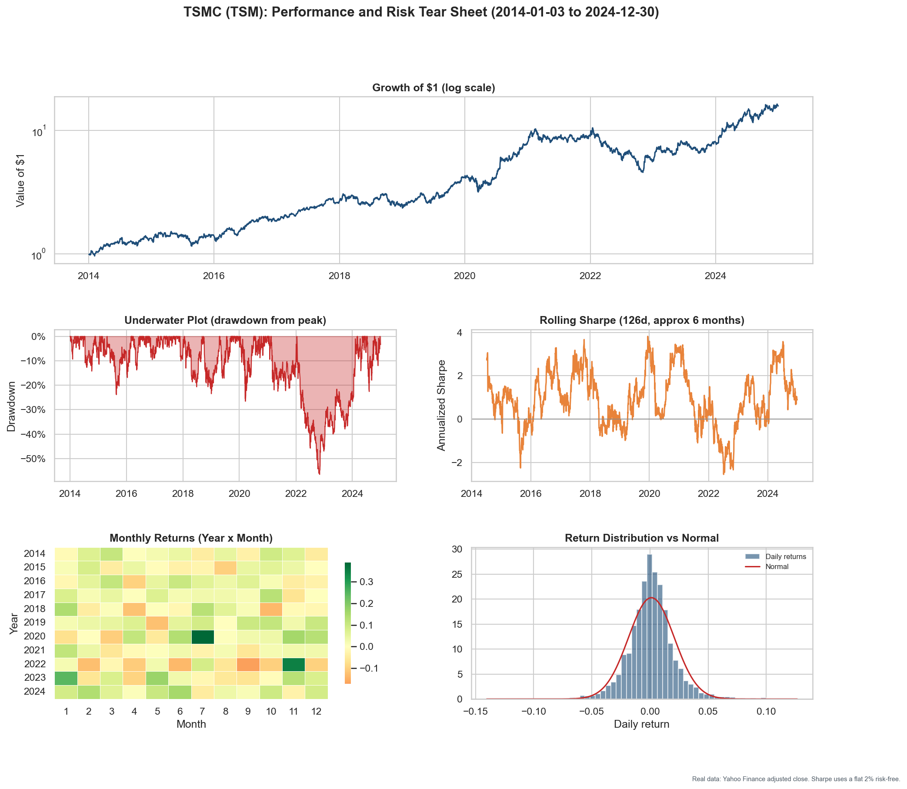

### Micron (MU)

## AI platforms and software

### Microsoft (MSFT)

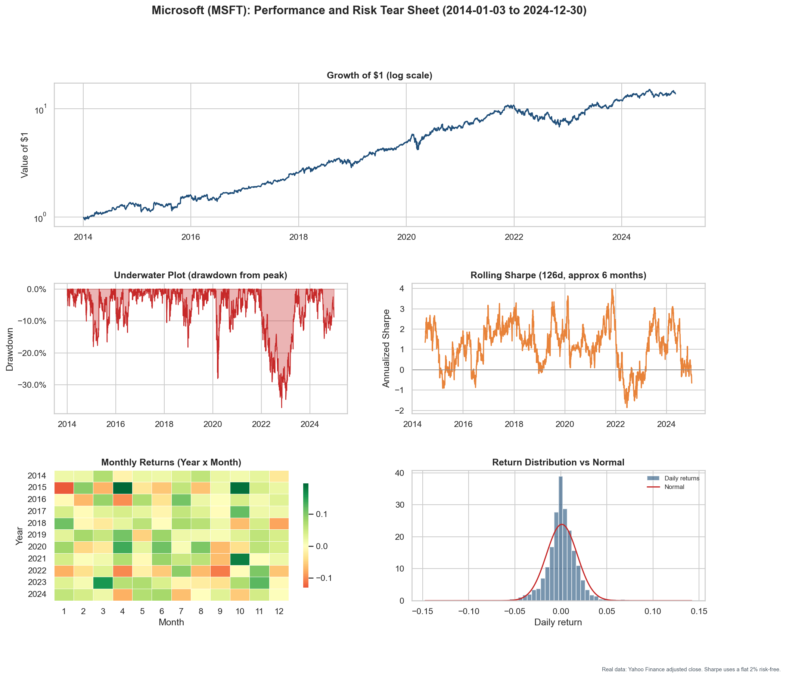

### Alphabet (GOOGL)

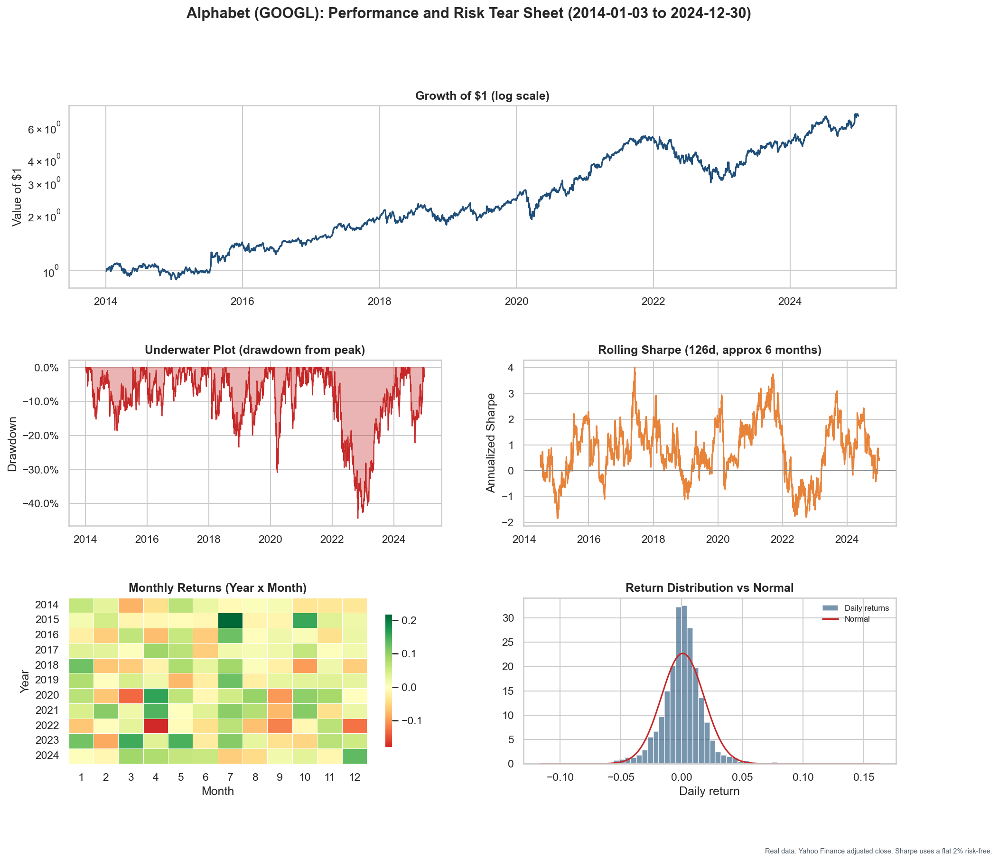

### Amazon (AMZN)

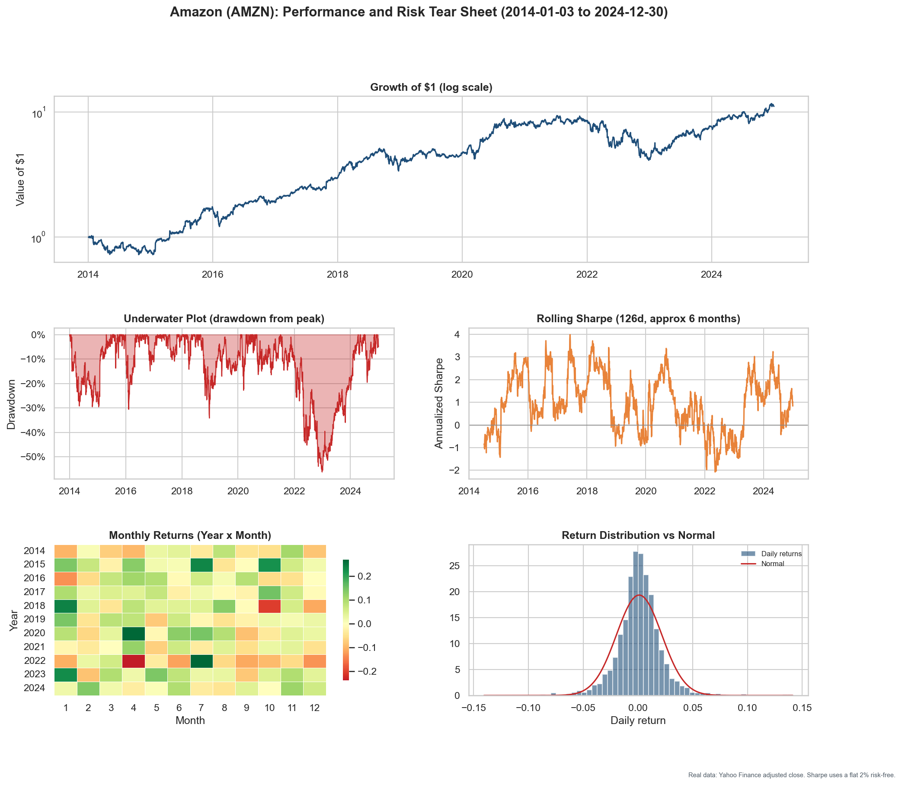

### Meta (META)

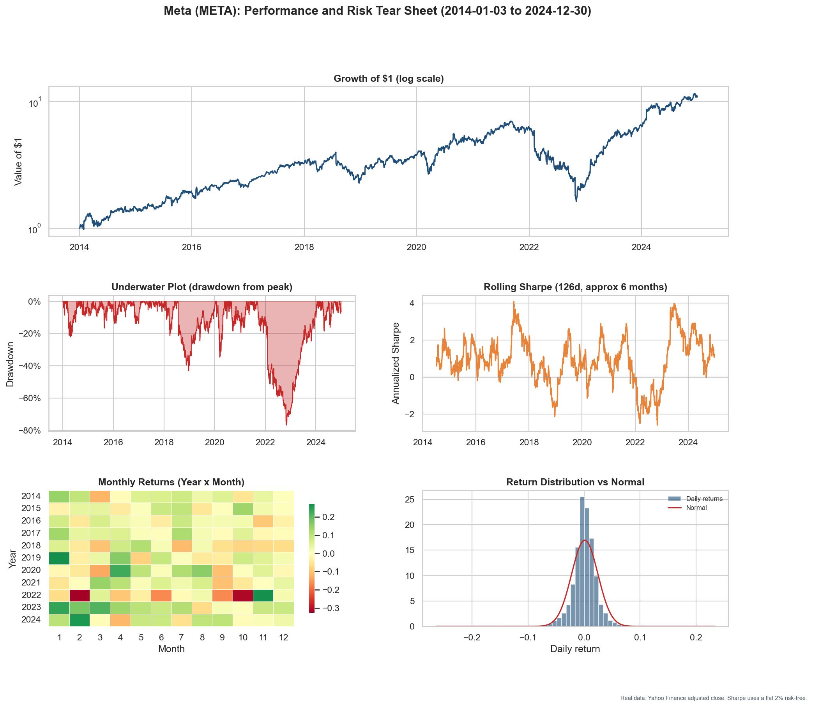

### Apple (AAPL)

### Oracle (ORCL)

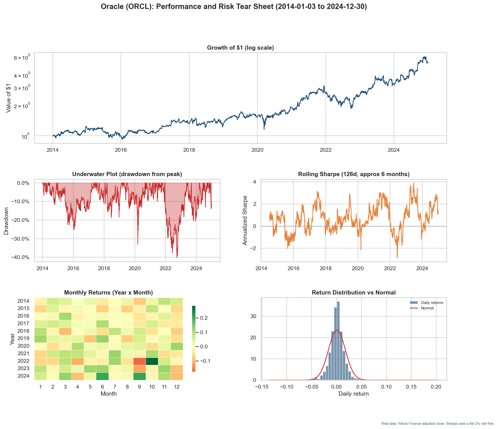

### Palantir (PLTR)

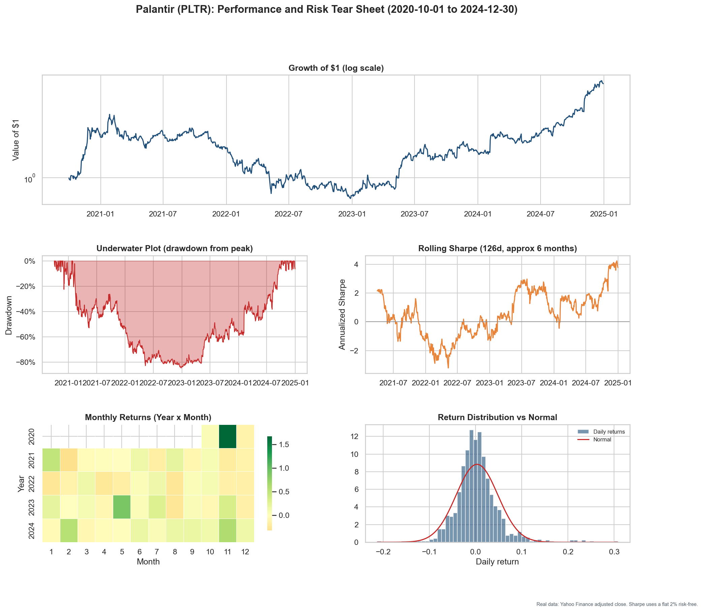

## Notes and limitations

- These are descriptive tear sheets of single assets and funds, not strategies. Past compounding does not predict future returns.
- The S&P 500 index (^GSPC) is price only, so it excludes dividends. SPY is a total-return series (dividends reinvested through the adjusted close), which is why SPY shows a higher CAGR than the index over the same window.
- AIQ, BOTZ, and PLTR launched after 2014, so their tear sheets cover shorter windows. PLTR in particular has only about four years of history, the deepest drawdown in the set, and a HAC t just below the significance threshold, so its statistics are the least reliable here.
- Sharpe and Sortino use a flat 2% annual risk-free rate, close to the average 3-month Treasury yield over the period.
- Yahoo adjusted closes are revised for splits and dividends after the fact, so they are not a point-in-time record of what a trader saw on the day.
